# 10 · 格魯吉亞 + 亞美尼亞 雙國行程（Qatar 吉隆坡航班版）

> 呢個係基於**新航班**（Qatar 經多哈，吉隆坡出發）嘅完整替代行程，加入**亞美尼亞**（Debed 峽谷修道院 → Dilijan → Sevan 湖 → 埃里溫 Yerevan → Khor Virap / Noravank / Tatev）。[03-每日行程](03-每日行程.md) 係原版（FlyDubai / 只玩格魯吉亞）。

## 新航班與行程窗口

| 段 | 航班 | 時間 |
|---|---|---|
| 去程 | KUL → DOH（QR855, 787）| 26/9 21:50 → 23:55 |
| | DOH → TBS（QR255, A320）| 27/9 07:55 → **12:35 到第比利斯** |
| 回程 | TBS → DOH（QR256, A320）| **10/10 14:00 走** → 16:15 |
| | DOH → KUL（QR852, 777）| 11/10 02:35 → 15:10 |

（香港⇄吉隆坡自理：Asia Miles 或平價機票 position。）

**實際窗口：9月27日(日) 12:35 到 → 10月10日(六) 14:00 走 = 約14個 day-slot（D1、D14 半日）。還車最遲 9/10（10/10 起飛日唔好安排過境/山路）。**

## 核心取捨

比原版多咗~2日，剛好夠加亞美尼亞。**代價：放棄西部 Svaneti**（遠西北，同亞美尼亞正南方向相反）。本行程 = **Kazbegi（北）+ 亞美尼亞（南，6晚）+ 卡赫季酒區（東）+ 第比利斯**，割捨 Svaneti / Kutaisi / 西部。

```mermaid
flowchart LR
    A[第比利斯 D1] --> B[Kazbegi 軍事公路 D2-3]
    B --> C[第比利斯 D4]
    C --> D["🛂過境 Sadakhlo/Bagratashen"]
    D --> E[Debed峽谷修道院 D5]
    E --> F[Dilijan→Sevan→Yerevan D6]
    F --> G[Yerevan+Garni/Geghard D7]
    G --> H[Khor Virap→Areni→Noravank→Goris D8]
    H --> I[Tatev+Khndzoresk D9]
    I --> J[Selim山口→Sevan/Dilijan D10]
    J --> K["🛂過境返格魯吉亞 D11"]
    K --> L[Sighnaghi酒區 D12]
    L --> M[還車第比利斯 D13]
    M --> N[✈️ 10/10 D14]
```

---

## ⚠️ 一、亞美尼亞過境「生死攸關」清單（訂車前搞掂）

呢幾樣任何一樣甩就過唔到境——**訂車時即刻確認，唔好等到出發**：

| 項目 | 詳情 |
|---|---|
| **1. 跨境授權書 POA** | 租車行必須開**公證授權書**，寫明你（護照）+ 車牌 + **明確列出「Armenia」**（籠統「出國」會被拒）。**至少提前1星期**要求；獨立辦公證要~2星期。**用電單車專門店**——⚠️ 好多車行淨係做車、唔做電單車跨境。**MotoTravel Georgia 有 Yerevan 分店，最適合**；Motorent（Levani）亦有經驗。書面確認：呢架電單車批准入亞美尼亞。 |
| **2. 亞美尼亞保險 CMTPL** | 格魯吉亞保險過境**即失效**（亞美尼亞唔喺 Green Card 系統）。過關後喺 Bagratashen 保險亭買亞美尼亞強制第三者（CMTPL）——電單車約 **6,000–9,000 AMD**，海關最低保 **10日**（就算你玩5–6日）。**帶 AMD 現金**（亭多數唔收卡、USD 匯率差）。堅持要印出嚟嘅保單，只畀單上金額。冇保險罰 100,000 AMD。 |
| **3. 返程格魯吉亞保險** | 返入格魯吉亞要格國 TPL——上 **tpl.ge** 網上買（電單車約 35 GEL/30日）。 |
| **4. 駕照錯配 ⚠️** | 香港 IDP 係 **1949 日內瓦版**，但**亞美尼亞係 1968 維也納公約國、唔喺香港 IDP 認可名單**（格魯吉亞就喺）。法理上香港 IDP 喺亞美尼亞冇效力。**帶齊：香港駕照正本 + IDP + 駕照嘅公證俄文/亞美尼亞文翻譯**——Syunik 有軍警檢查站，翻譯本最穩陣。**同你嘅旅遊/醫療保險確認**：用呢套證件騎車佢照唔照賠（否則可能以「非法定持牌」拒賠）。 |
| **5. 車輛臨時進口** | Georgian 車牌車入境會登記臨時進口，**留起所有邊境單據**，出境要出示，否則卡關。入境同出境用同一個口岸（Bagratashen）最穩。 |
| **6. 邊境時機** | Sadakhlo(GE)/Bagratashen(AM) 24小時開。**平日朝早過最快**（20–40分鐘）；週末下午可以排1.5–3小時。本行程去程 D5 星期四朝、返程 D11 星期三——啱晒。 |

---

## ⚠️ 二、亞美尼亞安全地理（唔可以亂闖）

亞塞拜疆邊境封閉+軍事化+有地雷。美國/英國政府「請勿前往」區：
- 亞塞拜疆邊境 **5km 內**
- Syunik **Goris 以東、Kapan 以南**（去伊朗方向嘅走廊）
- Sevan 湖 **Vardenis 以東**
- 北部 **Ijevan–Noyemberyan（M16/H26）**

**本行程全部避開**：Debed → Sevan(西/北岸) → Yerevan → Areni → **Goris/Tatev 為最南掉頭點**。鐵律：**Goris/Tatev 之後唔好再向南或向東**。Khndzoresk、Tatev 本身係正常旅遊點冇問題。出發前 48 小時再 check 美國 State Dept / 英國 FCDO 更新。

---

## 三、逐日行程

> 亞美尼亞段每朝 check：armroad.am（路況/封山）+ 天氣（山口2,400m）+ 油量。日落10月初~18:30–19:00，18:00前埋站。

### 🇬🇪 格魯吉亞北部

**D1 · 27/9（日）— 到埗、第比利斯**（~0 騎行）
12:35 落地 → Magti SIM + ATM 撳 500 GEL → Bolt 入城 → 酒店休息。黃昏遊舊城（Narikala 纜車、Abanotubani）、晚餐 Zakhar Zakharich khinkali。**確認租車行 Armenia POA 已 ready**。🛏 Hotel Old Tbilisi。

**D2 · 28/9（一）— 取車、軍事公路上 Kazbegi**（~170km）
10:30 取車（**驗車拍片 + 確認 Armenia 授權書、車牌正本喺手**）→ Mtskheta（Jvari + Svetitskhoveli）→ 軍事公路：Ananuri 城堡 → Gudauri 入油 → 友誼紀念碑 → Jvari 山口(2,379m) → Kazbegi。黃昏騎上 Gergeti 聖三一教堂。🛏 Rooms Hotel Kazbegi（山景房型）。

**D3 · 29/9（二）— Kazbegi 周邊**（~100km）
Truso 山谷碎石路（帶護照）或 Dariali 峽谷 + Gveleti 修道院。晚餐 Maisi（星期三休，今日冇事，要book）。🛏 Rooms Hotel Kazbegi。

**D4 · 30/9（三）— 落山返第比利斯、備戰過境**（~155km）
落軍事公路返第比利斯。下午：換 **AMD 現金**（過境用）、確認 POA/保險、養精蓄銳。可順遊 Mtskheta 未睇嘅嘢或市內。🛏 第比利斯。

### 🇦🇲 亞美尼亞（D5–D11，6晚）

**D5 · 1/10（四）— 過境 → Debed 峽谷修道院群**（~130km + 過境）
朝早出發 → Sadakhlo/Bagratashen 過境（**平日朝早，買亞美尼亞 CMTPL 保險**）→ 入 Debed 峽谷：**Akhtala**（拜占庭壁畫，免費）→ **Sanahin**（UNESCO，免費）→ **Haghpat**（UNESCO，免費，陡髮夾彎上）。峽谷路已 2023 重鋪但有零星水災修復段，慢騎。🛏 Tufenkian Avan Dzoraget（河畔4星，~US$95–105，有保安泊車）或 Iris B&B Alaverdi（~US$50）。

**D6 · 2/10（五）— Dilijan → Sevan 湖 → Yerevan**（~205km）
Debed → Vanadzor → **Dilijan**（「亞美尼亞瑞士」，Sharambeyan 老街 + 可選 Haghartsin 修道院；過 Dilijan 隧道/山口2,130m——初雪風險，check 天氣）→ **Sevan 湖**：Sevanavank 半島修道院（免費，~200級樓梯）+ **食 ishkhan 湖鱒魚**午餐 → Yerevan。🛏 Yerevan（Grand Hotel Yerevan / Republica / Villa Delenda，市中心有泊車）。

**D7 · 3/10（六）— Yerevan 市 + Garni/Geghard**（~80km）
朝：**Garni**（希臘式神廟 1,500 AMD）+ **Geghard**（UNESCO 岩鑿修道院，免費）東郊半日（靚電單車路）。下午 Yerevan：Cascade 階梯 + Cafesjian（週末先開）、Republic 廣場、**Vernissage 週末市集**、Matenadaran 古手稿館（2,000 AMD，週日一休——今日六冇事）。晚餐 Sherep 或 Lavash（要book）。可選 ARARAT 白蘭地 tasting（**唔騎車嗰晚先去**）。🛏 Yerevan。

> 💡 **3/10（六）係 Areni 葡萄酒節**（Areni 村，~1.5h 南面）。想去可將 D7/D8 對調，但酒節日人多兼**飲咗唔准騎**——建議照原 plan，Areni 平日順路品酒就夠。

**D8 · 4/10（日）— Khor Virap → Areni → Noravank → Goris**（~254km）
朝早 **Khor Virap**（Ararat 山經典前景，晨早最清，免費）→ M2 南下 **Areni**：Areni-1 洞（世界最古酒莊，~1,500 AMD）+ 酒村品酒（**少飲/吐酒，要繼續騎**）→ **Noravank**（紅崖峽谷修道院，免費，8km 靚彎路上去）→ 過 Vorotan 山口(2,344m) → **Goris**。**Areni 入滿油**（南段油站疏）。🛏 Hotel Mirhav Goris（石屋4星，保安泊車，~US$70）。

**D9 · 5/10（一）— Tatev + Khndzoresk**（~80km 本地，含窄山路）
⚠️ **Wings of Tatev 纜車逢星期一休**（今日一）——啱好**騎 H45 峽谷路落 Tatev**（~24 個崖邊髮夾彎過 **Devil's Bridge 溫泉**，西段有碎石/落石，confident riders only）——呢條路本身就係電單車體驗。**Tatev 修道院**（9–13世紀懸崖，免費）。下午 **Khndzoresk 吊橋 + 洞穴村**（Goris 以東10km，免費，落谷陡斜行1.5–2h）。🛏 Hotel Mirhav Goris。

> 想搭纜車（~7,000–9,000 AMD 來回）就要 Tue–Sun 到 Tatev——即係將南段日子避開星期一。

**D10 · 6/10（二）— Selim 絲路山口 → Sevan/Dilijan**（~230km）
北返走**風景線避免回頭**：Goris → Areni → **Selim/Vardenyats 山口(2,410m)**：1332年 Orbelian 絲路商隊驛站（免費）+ 經典髮夾彎——⚠️**初雪/大霧/黑冰風險，朝早 check armroad.am；封咗就改行 M2 經 Yerevan**。落 Sevan 湖 → Dilijan。🛏 Dilijan（Toon Armeni / Tufenkian Old Dilijan）或 Sevan 湖畔。晚餐 Dilijan **Kchuch**（陶罐燉菜）。

**D11 · 7/10（三）— 過境返格魯吉亞**（~250km + 過境）
Dilijan → Vanadzor → Debed → **Bagratashen/Sadakhlo 過境返格魯吉亞**（平日，出示臨時進口單據）→ 第比利斯。長日，早走。🛏 第比利斯。

### 🇬🇪 格魯吉亞收尾

**D12 · 8/10（四）— 卡赫季酒區**（~110km）
終於玩返 Georgia 酒鄉：第比利斯 → Gombori 山口 → **Sighnaghi「愛之城」**（城牆 + Bodbe 修道院）。晚餐 **Pheasant's Tears** 自然酒（要book，過夜先飲得）。🛏 Kabadoni 或 Zandarashvili 民宿。

**D13 · 9/10（五）— 還車、告別**（~110km）
Sighnaghi → 第比利斯，加滿油 → **17:00 還車**（查 video.police.ge 罰單、退押金）。晚餐 **Barbarestan**（要提早book）。🛏 Stamba 或 Old Tbilisi。

**D14 · 10/10（六）— 回程**
09:45 Bolt 去機場（唔好遲，check-in 閂櫃 12:00）→ 14:00 QR256 起飛。

---

## 四、亞美尼亞住宿速查

| 站 | 首選（有保安泊車） | 價/晚 | 平替 |
|---|---|---|---|
| Debed 峽谷 | **Tufenkian Avan Dzoraget**（河畔4星）| ~US$95–105 | Iris B&B Alaverdi ~US$50 |
| Yerevan（2晚）| **Grand Hotel Yerevan**（免費泊車，1920s地標）| ~US$100–145 | Villa Delenda ~US$78–99 / Republica |
| Goris（2晚）| **Hotel Mirhav**（石屋，庭院保安泊車）| ~US$70 | Yeghevnut ~US$33 |
| Dilijan | **Toon Armeni**（石屋+名物 gata）| ~US$60–90 | Tufenkian Old Dilijan |

> 亞美尼亞村屋民宿多數**現金 only（AMD）**，市區酒店收卡。Areni/Debed 村冇 ATM——喺 Alaverdi/Yerevan/Goris 撳定。

## 五、亞美尼亞必食

| 菜 | 係咩 |
|---|---|
| **Khorovats** | 國民 BBQ，葡萄藤炭燒肉配烤菜 lavash |
| **Dolma** | 葡萄葉卷肉飯 |
| **Lavash** | 薄餅（UNESCO），tonir 泥爐即烤 |
| **Zhingyalov hats** | 15+ 種香草餡薄餅（南部 Syunik 特產） |
| **Ishkhan** | Sevan 湖鱒魚，烤全條 |
| **Gata** | 牛油千層甜包（Dilijan / Toon Armeni 最正） |
| **Ghapama** | 南瓜釀飯乾果（Tavern Yerevan） |
| **Areni Noir / Voskehat** | 亞美尼亞紅/白酒（Areni 酒鄉） |
| **ARARAT / NOY 白蘭地** | 「高加索干邑」，試 10/15/20 年；買樽返手信 |

**Yerevan 餐廳**：Lavash、Sherep（開放廚房，新派）、Dolmama（高級，Bourdain 上過）、Tavern Yerevan（傳統熱鬧）、Tumanyan Khinkali（抵食）；酒吧 In Vino / Wine Republic（Saryan 酒街）。
**價位**：街坊餐 2,500–4,000 AMD、中檔 5,000–15,000 AMD、fine dining 35,000–50,000 AMD。小費 ~10% 現金。

## 六、亞美尼亞實用

| 項 | 詳情 |
|---|---|
| 貨幣 | Armenian dram（AMD），~385–400 AMD/USD、~139 AMD/GEL、~47 AMD/HKD。**GEL 唔收**，要換 AMD。Yerevan/城鎮有 ATM，村屋現金。帶 30,000–50,000 AMD buffer。 |
| SIM | 買本地 **Viva-MTS**（山區覆蓋最好）：TOURIST UNLIM ~2,500 AMD/30日。**格魯吉亞 Magti 過境只有貴漫遊**，唔好靠。峽谷/山口照樣有盲區。 |
| 油 | **AI-95 有得買但集中喺城鎮**（Flash/Max Oil/Gazprom），~550 AMD/L。鄉下多數只有 CNG/LPG/92。**Yerevan、Areni、Goris 入滿 95**，南段唔好賭。現金。 |
| 交規 | 限速 50/80-90/100；**酒駕零容忍**；頭盔強制；天眼多（Yerevan）。警察改革後好啲但仍有零星索賄——證件齊、要正式告票、唔好塞錢。 |
| 急救 | **911 或 112**（英文 OK）；Yerevan 醫院最好（Erebuni、Wigmore、Nairi）。買**明確承保電單車 + 醫療運送**嘅保險。 |
| 語言 | 亞美尼亞文；**俄文最通用**（鄉下/警察），Yerevan 有英文。問好「Barev」。修道院 dress code。 |

## 七、Plan B

| 情況 | 對策 |
|---|---|
| **Armenia POA 辦唔到 / 車行唔批** | 改行原版 [03-每日行程](03-每日行程.md)（冇亞美尼亞就有時間做返 Svaneti/西部）；亞美尼亞留返下次 |
| **Selim 山口(D10)封 / 落雪** | 改行 M2 經 Yerevan 返 Sevan（但注意 M2 都過 Vorotan 2,344m）；再唔得就 Yerevan 過一晚順延 |
| **Vorotan 山口(D8)落雪** | Goris/Tatev 當日可能去唔到——留低 buffer，改玩低地 Khor Virap/Areni/Noravank |
| **過境大排長龍** | 平日朝早過；D11 返程唔好留到 10/10 起飛日（已預 D11 過境 + D12-13 buffer） |
| **Tatev 想搭纜車** | 避開星期一（5/10）；將南段對調到 Tue–Sun |

---

> 詳細格魯吉亞段（住宿/餐廳/景點/實用）見 [04](04-住宿推薦.md)–[07](07-實用資訊.md)；亞美尼亞跨境摘要另見 [08-備選方案](08-備選方案.md) B 節。資料按 2025–26 年來源交叉核實，出發前（尤其 armroad.am 路況、政府安全公告、租車行書面確認）請再查。
