# 11 · 硬核大環線詳細路書：Kazbegi + Svaneti + 亞美尼亞

> **三合一大環線**（Qatar 吉隆坡航班 27/9–10/10）。順時針 loop 唔回頭：Kazbegi → Kutaisi → Svaneti → Akhaltsikhe → **Bavra 口岸** → Gyumri → Yerevan → **Debed** → 第比利斯。
>
> ⚠️ **零 buffer、日日長途、4 個 2,000m+ 山口 + 2 過境**。只適合資深騎士。想鬆動 → [12](12-鬆動版-Svaneti加亞美尼亞.md)（放棄 Kazbegi）；想安全 → [03](03-每日行程.md)（Svaneti 冇 Armenia）。
>
> 🕐 **時間全部係估算**（含停留），實際按路況/天氣/過境龍浮動。每朝出發前 check：georoad.ge / armroad.am + 天氣（山口高度）+ 當日景點營業。

```mermaid
flowchart LR
    A[第比利斯 D1] --> B[Kazbegi D2-3] --> C[Kutaisi D4] --> D[Mestia D5]
    D --> E[Ushguli D6] --> F[Zagari→Kutaisi D7] --> G[Akhaltsikhe D8]
    G --> H["🛂Bavra→Gyumri D9"] --> I[Yerevan D10] --> J[Garni/Geghard D11]
    J --> K["🛂Debed→第比利斯 D12"] --> L[還車 D13] --> M[✈️ D14]
```

## 總表

| D | 日期 | 路線 | 里程 | 山口 | 過夜 |
|---|---|---|---|---|---|
| 1 | 27/9 日 | 到埗第比利斯 | — | — | 第比利斯 |
| 2 | 28/9 一 | 取車→Mtskheta→Kazbegi | ~170km | Jvari 2,379m | Kazbegi |
| 3 | 29/9 二 | Kazbegi 周邊 | ~100km | — | Kazbegi |
| 4 | 30/9 三 | Kazbegi→Kutaisi ⚠️長 | ~300km | — | Kutaisi |
| 5 | 1/10 四 | Kutaisi→Zugdidi→Mestia | ~230km | — | Mestia |
| 6 | 2/10 五 | Mestia→Ushguli | ~47km | — | Ushguli |
| 7 | 3/10 六 | Ushguli→Zagari→Kutaisi | ~175km | Zagari 2,620m | Kutaisi |
| 8 | 4/10 日 | Kutaisi→Borjomi→Akhaltsikhe | ~200km | — | Akhaltsikhe |
| 9 | 5/10 一 | Akhaltsikhe→🛂Bavra→Gyumri | ~130km+境 | Bavra 高原 ~2,000m | Gyumri |
| 10 | 6/10 二 | Gyumri→Yerevan | ~120km | — | Yerevan |
| 11 | 7/10 三 | Yerevan + Garni/Geghard | ~80km | — | Yerevan |
| 12 | 8/10 四 | Yerevan→Debed→🛂→第比利斯 ⚠️長 | ~280km+境 | — | 第比利斯 |
| 13 | 9/10 五 | 還車 + 第比利斯 | — | — | 第比利斯 |
| 14 | 10/10 六 | ✈️ 14:00 起飛 | — | — | — |

---

## ⚠️ 跨境必辦（訂車起計）

**公證 POA**（寫明 Armenia，提前1週，電單車專門店 MotoTravel/Motorent）· **亞美尼亞 CMTPL 保險**（喺 **Bavra 入境時買**，~6,000–9,000 AMD 現金，覆蓋整個亞美尼亞段，Debed 出境都用）· **返程格魯吉亞 TPL**（tpl.ge 網上，~35 GEL）· **駕照錯配**（香港駕照+IDP+**公證俄/亞文翻譯**；同保險確認照賠）· **臨時進口單據**留起。**完整細節 → [10 文件第一節](10-格魯吉亞亞美尼亞行程.md)**。

**安全地理**：最南只到 Yerevan/Debed，遠離亞塞拜疆邊境敏感區。出發前 48h check 美國 State Dept / 英國 FCDO。

---

# 逐日詳細路書

## D1 · 27/9（日）— 到埗第比利斯

| 時間 | 事項 | 詳情 |
|---|---|---|
| 12:35 | 落地 TBS | 入境 ~20–40 分鐘 |
| 13:00 | 機場辦妥 | 行李帶後 **Magti 櫃位**買 SIM（15 GEL/5GB）· ATM 撳 500 GEL |
| 13:20 | Bolt 入城 | 25–35 GEL，30–40 分鐘；門外接客點。337 巴士唔使等 |
| 14:00 | 酒店 | Check-in、休息 |
| 16:30 | 舊城步行 | Narikala 纜車（Rike Park 上，2.5 GEL + 2 GEL Metromoney 卡）· Abanotubani 浴場區 · 和平橋 · Meidan 廣場 |
| 19:30 | 晚餐 | **Zakhar Zakharich**（16 Baratashvili St，膜拜級 khinkali，₾）或 Salobie Bia（Rustaveli 17 地庫） |
| 21:00 | 可選 | **Chreli-Abano 硫磺浴**（2 Abano St，私人房 ~200 GEL/hr，網上 booking.chreli-abano.ge） |

**📋 今日 To-do**：WhatsApp MotoTravel 確認 ①明早取車時間 ②**Armenia 授權書已 ready** ③車牌正本會交俾你過境。
🛏 **住宿**：Hotel Old Tbilisi（保安泊車，~US$82）或 Stamba（犒賞）

---

## D2 · 28/9（一）— 取車 → Mtskheta → Kazbegi（~170km，騎行 3–3.5h）

**入油**：Gudauri（上 Jvari 山口前）｜**山口**：Jvari 2,379m（雪崩廊道無燈）｜**check**：georoad.ge 軍事公路

| 時間 | 事項 | 詳情（位置 / 開放 / 停留） |
|---|---|---|
| 09:00 | Bolt 去車行 | **MotoTravel**，61 Shandor Petepis St, Tbilisi 0190（appointment） |
| 09:15 | 取車 | **逐格拍片**（車身/里數/油位/花痕）· 簽約 · €600 現金押金 · **確認 Armenia 授權書 + 車牌正本喺手** · 裝箱 |
| 10:30 | 出發 → Mtskheta | 25km / 30 分鐘 |
| 11:00 | **Jvari 修道院** | 6世紀 UNESCO，山頂，**免費**，~09:00–日落；鋪裝支路上，停車行 200m；兩河交匯經典景，風大（20 分鐘） |
| 11:40 | **Svetitskhoveli 大教堂** | Mtskheta 老城，11世紀 UNESCO，**免費**，~08:00–19:00，長褲/女頭巾（30 分鐘） |
| 12:30 | 軍事公路北上 | |
| 13:00 | **Ananuri 城堡** | 66km 處，路邊即達，**免費**，~09:00–19:00；塔樓睇 Zhinvali 碧水庫（45 分鐘） |
| 13:45 | 午餐 Pasanauri | 🍽 **Korbuda**（khinkali 發源地，9:30–22:30） |
| 15:00 | Gudauri 2,196m | ⛽ **入滿油** · **俄格友誼紀念碑**（蘇聯馬賽克觀景台，免費，路邊）；滑翔傘 250–350 GEL 可講價 |
| 15:45 | 過 Jvari 山口 | ⚠️ Gudauri–Kobi 雪崩廊道：**開大燈、除太陽眼鏡、同貨車保持距離**；Kvesheti-Kobi 工程改道 |
| 16:30 | Stepantsminda | Check-in **Rooms Hotel Kazbegi** |
| 17:00 | **Gergeti 聖三一教堂** | 騎 6km 鋪裝髮夾彎上 2,170m，**免費**，dress code（門口有布）；黃昏金光最靚（1h） |
| 19:30 | 晚餐 | 🍽 Rooms **The Kitchen**（8:00–24:00）或 **Tiba**（正對教堂）或 **Maisi**（Betlemi St，Gergeti，星期一開） |

⚠️ 山口清晨 0–5°C、可能有霜；出發前睇天氣。
🛏 **住宿**：Rooms Hotel Kazbegi（**山景房型**，提早幾個月訂）

---

## D3 · 29/9（二）— Kazbegi 周邊（~100km 本地）

**帶護照**（Truso / Dariali 近邊境檢查站）

| 時間 | 事項 | 詳情 |
|---|---|---|
| 08:30 | （補）Gergeti | 尋日冇上就今朝補，Kazbek 山朝早最清 |
| 10:00 | **Truso 山谷** | Kvemo Okrokana 轉入（Stepantsminda 南 10km）；碎石 jeep track ~25km 單程；礦泉鈣華、廢村、Zakagori 要塞（到此免 permit）；**帶護照**（3h 來回連影相） |
| 13:00 | 午餐 | 🍽 Stepantsminda 鎮：Tiba / **Qondari**（68 Kazbegi St，10:00–22:00，家庭式抵食） |
| 14:00 | **Dariali 峽谷** | 向俄邊境騎最後 12km（鋪裝，1,000m+ 絕壁）· Gveleti 修道院 · Gveleti 瀑布短 hike；**帶護照**（2h） |
| 16:30 | Rooms Hotel spa | 室內池 + 桑拿，騎行後回血 |
| 19:00 | 晚餐 | 🍽 **Maisi**（18 Betlemi St, Gergeti；khachoerbo 酥油芝士包、jonjoli 天婦羅；9:00–13:00 & 17:00–22:00，**星期三休——今日一冇事**；要 book） |

🛏 **住宿**：Rooms Hotel Kazbegi

---

## D4 · 30/9（三）— Kazbegi → Kutaisi（~300km，⚠️最長一日）

**⚠️ 早走**（避貨車 + 長日）｜**入油**：E60 沿途多｜區間測速——唔好偷雞

| 時間 | 事項 | 詳情 |
|---|---|---|
| 08:00 | 出發 | 落軍事公路（落山視角唔同，Ananuri 唔使再停） |
| 10:30 | 繞第比利斯 → E60 西行 | 雙程分隔快速路 |
| 11:30 | **可選** Gori | 史太林博物館（Stalin Ave 32，~10:00–18:00，全套連導賞 15 GEL，1h）— 攰就 skip |
| 12:30 | **可選** Uplistsikhe | Gori 東 10km，石窟城，10月 10:00–18:00，15 GEL + 語音 15（1.5h）— 兩個二選一或全 skip |
| 13:30 | 午餐 | 沿途或 Gori |
| 17:30 | Kutaisi | Check-in **Newport Hotel**（1914 法院改建，Colchis 噴泉旁，免費泊車） |
| 19:30 | 晚餐 | 🍽 **Palaty**（2 Pushkin St，歌劇院對面）或 **El Depo**（全城最佳 khinkali） |

⚠️ 呢日淨趕路都得——景點寧願全 skip 早啲到 Kutaisi 休息，聽日仲要入 Svaneti。
🛏 **住宿**：Newport Hotel Kutaisi

---

## D5 · 1/10（四）— Kutaisi → Zugdidi → Mestia（~230km，騎行 4.5–5h）

**⛽ 關鍵**：Zugdidi 入滿油（Svaneti 深山前最後大鎮）｜Mestia 有 Socar 站

| 時間 | 事項 | 詳情 |
|---|---|---|
| 08:30 | 出發 | |
| 09:00 | **可選** Gelati 修道院 | 11km，UNESCO，**免費**；⚠️主教堂內部**通常週末先開**（今日四只睇得 grounds + 部分馬賽克）· Bagrati 大教堂（山頂免費）（合共 1h，趕就 skip） |
| 10:30 | → Zugdidi | ~100km / 1.5h；⛽ **入滿油** + 午餐 |
| 12:30 | Zugdidi → Mestia | ~130km / 3–3.5h；恩古里水庫峽谷，**單線寬崖邊段、急彎、有牛**；**恩古里水壩**（751m 拱壩）觀景停 |
| 16:00 | Mestia 1,500m | Check-in |
| 16:30 | **Svaneti 博物館** | Ioseliani St 7，20 GEL，10:00–18:00，**星期一休——今日四 OK**；中世紀斯凡聖像寶庫，全國最佳地區博物館（1h） |
| 17:30 | 斯凡塔樓 | Margiani House 塔樓博物館（可爬，5–10 GEL）· 鎮內石塔群 |
| 19:30 | 晚餐 | 🍽 **Cafe Laila**（Seti 廣場，斯凡復調民歌 live，book +995 577 577 677）· 必食 **kubdari**（斯凡香料肉餅）· tashmijabi |

⛽ **Mestia Socar**（Irakli Parjiani St）——**今晚/明早入滿油**，Ushguli/Zagari 冇油站。
🛏 **住宿**：Hotel Banguriani（每房望 Ushba，~US$50）或 Posta（泳池）

---

## D6 · 2/10（五）— Mestia → Ushguli（~47km，短程，鬆動半日）

**⚠️ 出發前 Mestia 入滿油 + Ushguli 用現金**（Mestia ATM 撳定）

| 時間 | 事項 | 詳情 |
|---|---|---|
| 09:30 | Mestia 自由活動 | 補睇塔樓/博物館；有精力可騎去 **Chalaadi 冰川**（粗 track 到 Mestiachala 橋 + 45–60 分鐘 hike）——但會用大半日 |
| 11:30 | → Ushguli | 47km / 1.5–2h（2024 鋪裝，短碎石段） |
| 13:00 | **Ushguli** 2,100m | UNESCO 村落群，歐洲最高常住村；Check-in |
| 14:00 | Shkhara 冰川觀景 | 沿恩古里河谷騎/行 1–2km，**Shkhara 5,193m 冰川壁**經典視角，免長 hike |
| 16:00 | 村內慢遊 | **Lamaria 教堂**（12世紀）· 石塔群黃昏金光 |
| 19:00 | 晚餐 | 🍽 民宿 half-board（斯凡家常菜） |

⚠️ **全村冇 ATM、幾乎全現金**；電力熱水可能間歇；車泊民宿院內。
🛏 **住宿**：Ushguli Panorama Guest House（~US$39，現金）

---

## D7 · 3/10（六）— Ushguli → Zagari 山口 → Kutaisi（~175km，騎行 4h）

**⚠️ 出發前確認 Zagari（2,620m）路況**：georoad.ge + 問民宿；**過去幾日落大雨 / 今朝有雪就唔好行**，改 Mestia→Zugdidi 原路（用聽日消化）

| 時間 | 事項 | 詳情 |
|---|---|---|
| 08:30 | go/no-go | 天氣確認 |
| 09:00 | Ushguli → **Zagari 山口 2,620m** | ~73km 到 Lentekhi / 2h；90–99% 鋪裝，山泥傾瀉區短碎石 + 路邊漫水；**山口清晨黑冰——等太陽出先過**；金秋景觀高光 |
| 11:30 | Lentekhi | ⛽ **入油**（Mestia 之後第一個可靠站，Lentekhi/Tsageri 一帶） |
| 12:00 | → Tsageri → Kutaisi | ~90km；Racha 邊緣風景路 |
| 14:00 | Kutaisi | Check-in Newport |
| 15:00 | **Gelati 修道院** | 11km；⚠️**今日六——內部開放！**（週末+假期）；1125 年馬賽克 + 濕壁畫；**免費**（1h）· 順路 **Motsameta** 懸崖修道院（15 分鐘） |
| 17:00 | **Bagrati 大教堂** | 山頂全城景 + 日落 |
| 19:30 | 晚餐 | 🍽 **Baraqa**（合桃茄子、Adjaruli 芝士船）或 Palaty |

🛏 **住宿**：Newport Hotel Kutaisi

---

## D8 · 4/10（日）— Kutaisi → Borjomi → Akhaltsikhe（~200km，騎行 3.5h）

| 時間 | 事項 | 詳情 |
|---|---|---|
| 09:00 | 出發 → Borjomi | ~150km（經 Zestafoni） |
| 12:00 | **Borjomi** | 中央公園（幾 GEL）· **原泉直飲暖礦泉水** · 🍽 午餐 **Cafe Iggy**（Kostava 廣場；Borjomi 鱒魚包葡萄葉 + 石榴醬） |
| 14:00 | Borjomi 峽谷 → Akhaltsikhe | ~50km 林道 |
| 15:30 | **Rabati 城堡** | 2012 重建鄂圖曼-格魯吉亞城堡群；下庭免費，**上堡外國人 20 GEL**（清真寺 + Samtskhe-Javakheti 博物館），~09:00–19/20:00（1.5–2h） |
| 19:00 | 晚餐 | 🍽 Potskhovi 河左岸炭燒 **mtsvadi**（城堡夜景）或 Hotel Lomsia 餐廳 |

**📋 今晚 To-do**：換定啲 USD/GEL 現金（明早過境買亞美尼亞保險用；AMD 過關後買）· 再確認 POA + 臨時進口準備 · tpl.ge 睇定返程格魯吉亞保險。
🛏 **住宿**：Hotel Lomsia（Kostava St 10，行去 Rabati，~US$62–81）

---

## D9 · 5/10（一）— Akhaltsikhe → 🛂Bavra → Gyumri（~130km + 過境，~4h 含境）

**⛽ Akhaltsikhe/Ninotsminda 入滿油**（Bavra 高原站疏）｜**帶齊**：護照、POA、車牌、IDP + 翻譯、現金

| 時間 | 事項 | 詳情 |
|---|---|---|
| 09:00 | 出發 | Akhaltsikhe → Ninotsminda ~70km；**Javakheti 高原 ~2,000m，暴露多風凍、部分路段未鋪裝**（乾天 ADV OK，layer up） |
| 10:30 | **Bavra/Ninotsminda 過境** | 24h；格方出境 → no-man's land → 亞方入境（HK 免簽）→ **買亞美尼亞 CMTPL 保險**（~6,000–9,000 AMD 現金，要印出嘅單）→ 海關臨時進口登記（~1–1.5h，平日一 OK） |
| 12:00 | → Gyumri | ~60km / 1h |
| 13:00 | Gyumri 午餐 | 🍽 **Cherkezi Dzor**（鱒魚）或 **Poloz Mukuch**（傳統 tavern，Gyumri 以好客+幽默聞名） |
| 14:30 | **Kumayri 歷史區** | 黑/紅火山石老城、Abovyan 街、19–20 世紀老宅 |
| 15:15 | **Vardanants 廣場** | Seven Wounds 教堂 + Vardan Mamikonyan 像 · ⚠️ **Dzitoghtsyan 建築博物館**（1872 大宅）**星期一或休——check** |
| 16:00 | **Black Fortress（Sev Berd）** | 1830s 圓堡 + 圓形劇場，睇城景 + 土耳其邊境（開車路可上，泊車易）（1h） |
| 19:00 | 晚餐 | 🍽 Gyumri 本地 tavern |

🛏 **住宿**：**Villa Kars**（新藝術風精品，庭院——**確認電單車泊車**）或 Hotel Plaza Viktoria（Vardanants 廣場旁）

---

## D10 · 6/10（二）— Gyumri → Yerevan（~120km）+ Yerevan

**⛽ Gyumri 或途中入油**｜M1 現代 4 線快速路

| 時間 | 事項 | 詳情 |
|---|---|---|
| 09:00 | Gyumri 收尾 | 未去嘅 Black Fortress / Abovyan 街咖啡 |
| 10:00 | → Yerevan | M1 ~120km / 1.5h |
| 11:30 | Yerevan | Check-in **Grand Hotel Yerevan**（Abovyan 14，免費泊車） |
| 13:00 | 午餐 + 市中心 | Republic 廣場（粉紅凝灰岩，晚上 ~21:00 音樂噴泉） |
| 14:30 | **Cascade + Cafesjian** | 戶外階梯 + 雕塑（24h 免費，Botero）；⚠️**室內畫廊 Fri–Sun 先開——今日二只玩戶外**；頂上通 Mother Armenia 觀景 |
| 16:00 | **Matenadaran** | 古手稿館，Mashtots 大道頂，2,000 AMD，Tue–Sat 10:00–17:50，**今日二 OK**（1h） |
| 17:00 | 自由 | ⚠️ Vernissage 市集**週末先旺**（今日二只小量攤）；可改 **Genocide 紀念館**（Tsitsernakaberd，免費，Tue–Sun，~15:30 尾） |
| 19:30 | 晚餐 | 🍽 **Sherep**（Amiryan 1，開放廚房新派）或 **Lavash**（Tumanyan 21，tonir 現烤）——book |
| 21:00 | 可選 | Saryan 酒街 **In Vino** 品亞美尼亞酒；或 **ARARAT 白蘭地** tasting（唔騎車，市內 OK） |

🛏 **住宿**：Grand Hotel Yerevan

---

## D11 · 7/10（三）— Yerevan + Garni / Geghard（~80km）

| 時間 | 事項 | 詳情 |
|---|---|---|
| 09:00 | → **Garni 神廟** | 東 30–40km（靚電單車路）；1世紀希臘式神廟，**1,500 AMD**，~10:00–18:00+；下方 **Symphony of Stones** 玄武岩柱峽谷（1h） |
| 11:00 | **Geghard 修道院** | 再上 10km，UNESCO 岩鑿修道院，**免費**，~08:00–20:00（1h） |
| 13:00 | 返 Yerevan 午餐 | |
| 14:30 | 下午自由（三選一） | ① **Khor Virap**（南 40km，Ararat 山景，免費——但晨早最清，下午可能有雲）② **Echmiadzin 大教堂**（西 20km，2024 重開）+ **Zvartnots**（UNESCO，~1,500 AMD，**週一休、今日三 OK**）③ History Museum（Areni 古鞋） |
| 19:30 | 晚餐 | 🍽 **Dolmama**（10 Pushkin St，高級東亞美尼亞菜）或 **Tavern Yerevan**（傳統熱鬧） |

🛏 **住宿**：Grand Hotel Yerevan

---

## D12 · 8/10（四）— Yerevan → Debed → 🛂Bagratashen → 第比利斯（~280km + 過境，⚠️長日）

**⚠️ 早走 08:00**（長日 + 過境）｜**⛽ Yerevan/Vanadzor 入油**

| 時間 | 事項 | 詳情 |
|---|---|---|
| 08:00 | Yerevan → M6 北上 | ~180km / 2.5–3h 到 Debed |
| 11:00 | **Sanahin 修道院** | Alaverdi 上方，10世紀 UNESCO，**免費**，陡髮夾彎上（45 分鐘） |
| 12:00 | **Haghpat 修道院** | 16km，10世紀 UNESCO，**免費**（45 分鐘）· 🍽 午餐 Alaverdi/Haghpat |
| 13:30 | **可選** Akhtala | 近邊境，拜占庭壁畫，免費（有時間先去，30 分鐘） |
| 14:30 | **Bagratashen 過境返格魯吉亞** | 出示臨時進口單據；平日四；返格前 tpl.ge 買定格國 TPL（~1h） |
| 16:00 | → 第比利斯 | ~75km / 1h |
| 17:30 | 第比利斯 | Check-in |
| 19:30 | 晚餐 | 🍽 輕鬆（舊城） |

⚠️ 第二個「長途+過境」日——**唔好喺修道院流連太耐**，跟時間走。
🛏 **住宿**：第比利斯

---

## D13 · 9/10（五）— 還車 + 第比利斯

| 時間 | 事項 | 詳情 |
|---|---|---|
| 09:30 | 第比利斯自由 | Dry Bridge 古董市集（10:00–17:00）· Mtatsminda 纜索鐵路 · 或 Chreli-Abano 浴場 |
| 15:00 | 準備還車 | ⛽ **加滿油** · 上 **video.police.ge 查天眼罰單**（有就即交，10 日內 8 折） |
| 17:00 | **還車** | MotoTravel appointment；驗車拍片；**取回 €600 押金** |
| 20:00 | 告別晚餐 | 🍽 **Barbarestan**（132 D. Aghmashenebeli Ave，19 世紀公爵夫人食譜；兔肉火腿卷、南瓜餅；**提早 1–2 週 book**） |

🛏 **住宿**：Stamba（犒賞）或 Old Tbilisi

---

## D14 · 10/10（六）— 回程

| 時間 | 事項 |
|---|---|
| 09:45 | Bolt 去 TBS（30–40 分鐘） |
| ~11:30 | 到機場（check-in 閂櫃 13:00 = 起飛前 60 分鐘；2h 前到最穩） |
| 14:00 | **QR256 起飛** → DOH 16:15 → QR852 → KUL → 香港 |

---

# 附錄

## ⛽ 入油計劃（關鍵點）

| 日 | 入油點 | 點解 |
|---|---|---|
| D2 | **Gudauri** | 上 Jvari 山口前 |
| D4 | E60 沿途 | 隨意 |
| D5 | **Zugdidi** | Svaneti 深山前最後大鎮 |
| D6 | **Mestia（Socar）** | ⚠️ Ushguli/Zagari 冇油站 |
| D7 | **Lentekhi/Tsageri** | Mestia 後第一個站（~100km） |
| D8 | Kutaisi | |
| D9 | **Akhaltsikhe/Ninotsminda** | ⚠️ 過 Bavra 前；亞美尼亞 AI-95 集中城鎮 |
| D10 | Gyumri | |
| D12 | **Yerevan/Vanadzor** | 北上 Debed 前 |

## 📅 撞正嘅休館/營業日（已對齊）

| 景點 | 規律 | 你嘅日子 |
|---|---|---|
| Kazbegi **Maisi** 餐廳 | 星期三休 | D3 二 ✅ |
| **Svaneti 博物館** | 星期一休 | D5 四 ✅ |
| **Gelati** 內部 | 週末+假期先開 | D5 四 只 grounds；**D7 六 內部開 ✅** |
| Gyumri **Dzitoghtsyan 博物館** | 或星期一休 | D9 一 ⚠️ 現場 check（戶外景點照玩） |
| Yerevan **Cafesjian 畫廊** | Fri–Sun | D10 二/D11 三 ❌（戶外 Cascade 照玩） |
| Yerevan **Vernissage 市集** | 週末先旺 | D10 二/D11 三 ⚠️ 小量 |
| **Matenadaran** | 週日/一休 | D10 二 ✅ |
| **Zvartnots** | 星期一休 | D11 三 ✅ |

## 風險 / Plan B

| 情況 | 對策 |
|---|---|
| **Zagari 封（D7）** | Ushguli 折返 Mestia → Zugdidi → Kutaisi（多 ~1h） |
| **Bavra 落雨/太凍（D9）** | 改 Sadakhlo/Bagratashen 入（變回頭路，少咗 Gyumri） |
| **落後於進度** | 砍 D4 Gori/Uplistsikhe、D8 Borjomi、D11 下午、Gyumri 縮短 |
| **覺得太趕** | → [12](12-鬆動版-Svaneti加亞美尼亞.md)（放棄 Kazbegi）或 [03](03-每日行程.md)（放棄 Armenia） |

## A · 距離 / 時間表（逐段）

| 日 | 路段 | km | 騎行時間 | 路況備註 |
|---|---|---|---|---|
| D2 | Tbilisi → Mtskheta | 25 | 0:30 | 高速 |
| D2 | Mtskheta → Ananuri | 40 | 0:45 | 軍事公路 |
| D2 | Ananuri → Gudauri | 30 | 0:40 | 爬升 |
| D2 | Gudauri → Kazbegi | 30 | 0:45 | **Jvari 山口 2,379m**，雪崩廊道 |
| D2 | *（合計 Tbilisi→Kazbegi）* | *~157* | *3–4.5h 連停* | |
| D2 | Kazbegi → Gergeti 教堂 | 6 | 0:20 | 鋪裝髮夾彎（上） |
| D3 | Kazbegi → Truso 轉入 | 10 | 0:15 | 之後 25km 碎石 track（單程） |
| D3 | Kazbegi → Dariali | 12 | 0:20 | 鋪裝，近俄邊境 |
| **D4** | **Kazbegi → Kutaisi** | **~300** | **~5h** | ⚠️最長；軍事公路落 + E60 |
| D5 | Kutaisi → Gelati | 11 | 0:20 | 山路 |
| D5 | Kutaisi → Zugdidi | 100 | 1:30 | 主幹 |
| D5 | Zugdidi → Mestia | 130 | 3–3.5h | 恩古里峽谷，單線崖邊、有牛 |
| D6 | Mestia → Ushguli | 47 | 1.5–2h | 2024 鋪裝 + 短碎石 |
| D7 | Ushguli → Zagari → Lentekhi | 73 | 2:00 | **Zagari 2,620m**，90–99% 鋪裝 |
| D7 | Lentekhi → Kutaisi | 90 | 2:00 | Racha 邊緣風景路 |
| D8 | Kutaisi → Borjomi | 150 | 2.5h | 主幹 |
| D8 | Borjomi → Akhaltsikhe | 50 | 1:00 | 峽谷林道 |
| **D9** | Akhaltsikhe → Bavra 口岸 | 70 | 1.5h | **高原 ~2,000m，部分未鋪裝** |
| D9 | Bavra → Gyumri | 60 | 1:00 | +過境 ~1–1.5h |
| D10 | Gyumri → Yerevan | 120 | 1.5h | M1 4 線快速 |
| D11 | Yerevan → Garni | 35 | 0:50 | 靚彎路 |
| D11 | Garni → Geghard | 10 | 0:20 | |
| D11 | *(可選)* Yerevan → Khor Virap | 40 | 0:50 | 平路，Ararat 景 |
| **D12** | Yerevan → Debed(Haghpat) | 180 | 2.5–3h | M6 |
| D12 | Debed → Bagratashen 口岸 | 40 | 0:45 | +過境 ~1h |
| D12 | Bagratashen → Tbilisi | 75 | 1:00 | ⚠️D12 全程長 |

> 全程 **~1,900–2,000km**（含 ~150km Svaneti 高山路 + 碎石）。**每日只計移動時間，未計停留**——山路平均 45–60 km/h，預鬆啲。

## B · 住宿詳情（每站 2–3 選，連價 / 泊車）

| 站（日） | 首選 ⭐ | 平替 | 犒賞 |
|---|---|---|---|
| 第比利斯（D1/12/13） | **Hotel Old Tbilisi** US$82，**保安泊車** | ibis Styles US$68–105（冇泊車） | **Stamba** US$185–313，免費私人泊車 |
| Kazbegi（D2–3） | **Rooms Hotel Kazbegi** 山景 US$165–271，泳池桑拿、免費泊車 | Guest House Tamta 9.7 / Red Stone <US$50 | — |
| Kutaisi（D4/7） | **Newport Hotel** US$66–110，市中心免費泊車 | Guesthouse Old Town US$25–40，免費私人泊車 | Communal Hotel US$90–140（泊車 off-site） |
| Mestia（D5） | **Hotel Banguriani** ~US$50，每房 Ushba 景 | Panorama Guesthouse US$25–40（早餐勁） | Hotel Posta US$100–130，室內池 |
| Ushguli（D6） | **Ushguli Panorama** ~US$39（**現金**，餐廳露台） | Maspindzeli US$13–20（**現金**） | — |
| Akhaltsikhe（D8） | **Hotel Lomsia** US$62–81，行去 Rabati | — | Crowne Plaza Borjomi US$88–150（改住 Borjomi） |
| Gyumri（D9） | **Villa Kars** 新藝術精品，庭院（**確認電單車泊車**） | Hotel Plaza Viktoria，Vardanants 廣場旁 | — |
| Yerevan（D10–11） | **Grand Hotel Yerevan** US$100–145，1920s，**免費泊車** | Villa Delenda US$78–99，免費私人泊車 | The Alexander（Marriott）US$225–375 |

> 郊區/村屋（Ushguli）**現金 only**；Booking.com message 逐間確認「motorcycle in courtyard」。詳見 [04](04-住宿推薦.md)（格）/ [10](10-格魯吉亞亞美尼亞行程.md)（亞）。

## C · 餐廳詳情（每站，連招牌 / 價 / 備註）

| 站 | 推介 | 招牌 / 價 / 備註 |
|---|---|---|
| 第比利斯 | **Zakhar Zakharich**（16 Baratashvili St）| 膜拜級 khinkali ~2–2.5 GEL/隻，₾ |
| | **Barbarestan**（132 Aghmashenebeli Ave）| 19 世紀食譜；連酒 100–150 GEL；**必 book**（告別晚餐） |
| | Shavi Lomi / Salobie Bia | 新派格魯吉亞，₾₾ |
| 路上（D2） | **Korbuda**（Pasanauri）| khinkali 發源地，9:30–22:30 |
| Kazbegi | **Maisi**（Gergeti）| 鎮上最精緻；**星期三休**；要 book |
| | Rooms The Kitchen / Tiba / Qondari | 教堂景 / 抵食 |
| Kutaisi | **El Depo** | 全城最佳 khinkali，₾ |
| | Palaty（歌劇院對面）/ Baraqa | 名店 / Adjaruli 芝士船 |
| Mestia | **Cafe Laila**（Seti 廣場）| 斯凡民歌 live，book +995 577 577 677；**kubdari** |
| | Old House / Lushnu Qor | 壁爐塔景 / kubdari 快手 |
| Ushguli | 民宿 half-board | 斯凡家常菜，現金 |
| Borjomi | **Cafe Iggy**（Kostava 廣場）| 鱒魚包葡萄葉 + 石榴醬 |
| Akhaltsikhe | Potskhovi 河左岸烤肉 | 炭燒 mtsvadi，城堡景 |
| **Gyumri** | **Cherkezi Dzor** | 養殖鱒魚 |
| | **Poloz Mukuch** | 傳統 tavern，Gyumri 好客幽默 |
| **Yerevan** | **Sherep**（Amiryan 1）/ **Lavash**（Tumanyan 21）| 新派 / tonir 現烤，book，8,000–15,000 AMD |
| | **Dolmama**（10 Pushkin St）| 高級，20,000–40,000 AMD |
| | Tavern Yerevan / Tumanyan Khinkali | 傳統熱鬧 / 抵食 |
| | In Vino（Saryan 酒街）/ ARARAT 白蘭地 | 亞美尼亞酒 / 干邑 tasting（唔騎車嗰晚） |

> 必食：格 khinkali/khachapuri/mtsvadi/kubdari；亞 khorovats/dolma/lavash/ishkhan/gata/Areni 酒/ARARAT 白蘭地。詳見 [05](05-餐廳美食.md)（格）/ [10](10-格魯吉亞亞美尼亞行程.md)（亞）。

## D · 景點速查（開放 / 門票 / 停留 / 泊車）

| 景點 | 開放 | 門票 | 停留 | 備註 |
|---|---|---|---|---|
| Jvari 修道院（Mtskheta） | ~09:00–日落 | 免費 | 20 分 | 山頂大停車場行 200m |
| Svetitskhoveli 大教堂 | ~08:00–19:00 | 免費 | 30 分 | dress code |
| Ananuri 城堡 | ~09:00–19:00 | 免費 | 45 分 | 路邊即達 |
| 友誼紀念碑 | 24h | 免費 | 15 分 | 路邊觀景 |
| **Gergeti 聖三一教堂** | 日光 | 免費 | 1h | 6km 鋪裝上，黃昏靚 |
| Truso 山谷 | — | 免費 | 3h | 碎石，**帶護照** |
| Dariali 峽谷 | — | 免費 | 2h | **帶護照** |
| Gelati 修道院 | 內部週末開 | 免費 | 1h | **D7 六內部開** |
| **Svaneti 博物館**（Mestia） | 10:00–18:00 | 20 GEL | 1h | **週一休**（D5 四 OK） |
| **Ushguli** + Shkhara 觀景 | — | 免費 | 半日 | 現金村 |
| Rabati 城堡（Akhaltsikhe） | ~09:00–19/20:00 | 上堡 20 GEL | 1.5–2h | 下庭免費 |
| Gyumri Black Fortress | 開放 | 免費 | 1h | 開車路可上 |
| Gyumri Kumayri 老城 | — | 免費 | 1.5h | 步行 |
| Garni 神廟 | ~10:00–18:00+ | 1,500 AMD | 1h | + Symphony of Stones |
| Geghard 修道院 | ~08:00–20:00 | 免費 | 1h | UNESCO 岩鑿 |
| Khor Virap（可選） | 日光 | 免費 | 1–1.5h | Ararat 景，晨早最清 |
| Matenadaran（Yerevan） | 10:00–17:50 | 2,000 AMD | 1h | **週日/一休**（D10 二 OK） |
| Cascade 戶外 | 24h | 免費 | 1h | 室內畫廊 Fri–Sun |
| Haghpat / Sanahin（Debed） | ~10:00–日落 | 免費 | 各 45 分 | UNESCO，陡髮夾彎上 |

> 亞美尼亞修道院多數**免費**（付款位現金 AMD）；2026 門票如有加價出發前核實。格魯吉亞景點全細節見 [06](06-景點指南.md)。

## E · Google Map 圖釘（可匯入 My Maps）

**匯入方法（30 秒）**：
1. 電腦開 **mymaps.google.com** → 建立新地圖
2. 左欄「**匯入**」→ 上載 repo 內嘅 **`georgia-armenia-loop-pins.csv`**
3. 「設定位置的欄」揀 **Latitude + Longitude**；「標題欄」揀 **Name**
4. 可用「**Day**」或「**Category**」做分層/上色（例如 Fuel 一色、Border 一色、Sight 一色）
5. 完成——手機開 Google Maps → 已儲存 → 你嘅地圖，離線都睇到圖釘

> ⚠️ 標「座標約」嗰幾個（山口、Truso、Bavra、車行）係大約位置——**導航時用埋個名 search 確認**。全部 65 個點喺 CSV，下面係精選一覽：

| 類 | 點（座標） |
|---|---|
| 🏍 物流 | TBS 機場(41.669,44.955) · MotoTravel 車行(~41.71,44.78) |
| 🛏 過夜 | Rooms Hotel Kazbegi(42.656,44.639) · Newport Kutaisi(42.268,42.705) · Banguriani Mestia(43.045,42.730) · Ushguli Panorama(42.916,43.016) · Lomsia Akhaltsikhe(41.640,42.985) · Villa Kars Gyumri(40.790,43.845) · Grand Hotel Yerevan(40.182,44.515) |
| ⛽ 入油 | Gudauri(42.478,44.478) · Zugdidi(42.509,41.871) · **Mestia Socar**(43.042,42.725) · Lentekhi(42.789,42.725) · **Ninotsminda**(41.265,43.595) |
| 🛂 過境 | **Bavra**(~41.20,43.65 入亞) · **Bagratashen**(41.209,44.816 返格) |
| ⛰ 山口 | Jvari 2379m(~42.502,44.453) · **Zagari 2620m**(~42.86,43.00) |
| ⛪ 格景點 | Jvari 修道院(41.838,44.733) · Ananuri(42.163,44.703) · **Gergeti 教堂**(42.663,44.620) · Gelati(42.295,42.768) · **Ushguli/Shkhara**(42.930,43.040) · Rabati 城堡(41.639,42.986) |
| ⛪ 亞景點 | Gyumri Black Fortress(40.786,43.825) · Republic Sq(40.178,44.513) · Cascade(40.191,44.515) · **Garni**(40.112,44.730) · **Geghard**(40.160,44.818) · Khor Virap(39.878,44.577) · **Haghpat**(41.092,44.711) · Sanahin(41.084,44.667) |

**（純睇圖，唔匯入都得）**：直接 Google Maps search 上面每個名都跳到；或用座標 `lat,lng` 貼入搜尋框。

---

> 圖釘 CSV：[`georgia-armenia-loop-pins.csv`](georgia-armenia-loop-pins.csv)（65 點，Name/Lat/Lng/Day/Category/Notes）。格魯吉亞住宿/餐廳/景點/實用全細節見 [04](04-住宿推薦.md)–[07](07-實用資訊.md)；亞美尼亞跨境/住宿/實用見 [10](10-格魯吉亞亞美尼亞行程.md)。時間/座標為估算，出發前（georoad.ge / armroad.am 路況、政府安全公告、租車行 POA 書面確認、各景點 2026 開放時間）務必再查。
