# 🏍️ 格魯吉亞電單車之旅 — 2026年9月28日至10月10日（確認航班版）

> 吉隆坡出發 · Qatar 經多哈 · ~11個騎行日 · 大高加索環線 · 約2,100公里

## 航班（已確認 · Qatar Airways）

| 日期 | 航班 | 時間 | 航段 |
|---|---|---|---|
| 26/9（六） | QR855 | 21:50–23:55 | 吉隆坡 KUL → 多哈 DOH |
| **27/9（日）** | — | **多哈 stopover 成日** | 🕌 多哈一日遊 |
| 28/9（一） | QR253 | 15:30–**20:10** | 多哈 DOH → 第比利斯 TBS |
| 10/10（六） | QR256 | **14:00**–16:15 | 第比利斯 TBS → 多哈 DOH |
| 11/10（日） | QR852 | 02:35–15:10 | 多哈 DOH → 吉隆坡 KUL |

**格魯吉亞窗口：28/9（一）晚 20:10 到 → 取車 29/9（二）→ 還車 9/10（五）→ 10/10（六）14:00 飛 = ~11 個騎行日。**

> 💡 去程多哈 **27/9 有成日** stopover（Qatar Stopover，4–5 星酒店 US$14 起）——伊斯蘭藝術博物館、Souq Waqif、國家博物館、Katara。
>
> ⚠️ **香港⇄吉隆坡** positioning 自理（Asia Miles 或平票）。

> **📌 行程版本**：確認咗係 ~11 日窗口 → **正選係本檔（[03 每日行程](03-每日行程.md)，Kazbegi + Svaneti 完整格魯吉亞環線）**。加入亞美尼亞嘅版本（[10](10-格魯吉亞亞美尼亞行程.md)/[11](11-大環線-Svaneti加亞美尼亞.md)/[12](12-鬆動版-Svaneti加亞美尼亞.md)）**需要 ~14 日，喺呢個 11 日窗口塞唔落**，除非延長行程；保留作參考。

## 路線總覽

```mermaid
flowchart LR
    A[第比利斯<br/>抵埗28/9晚·D1取車] --> B[卡茲別克 Kazbegi<br/>D2-D3 軍事公路]
    B --> C[Telavi 卡赫季酒區<br/>D4]
    C --> D[Sighnaghi 愛之城<br/>D5]
    D --> E[Gori/Uplistsikhe → Kutaisi<br/>D6 · Gelati週日開]
    E --> F[Mestia 斯瓦涅季<br/>D7]
    F --> G[Ushguli 歐洲最高村<br/>D8]
    G --> H[Zagari山口 → Kutaisi<br/>D9]
    H --> I[Borjomi/Akhaltsikhe<br/>D10]
    I --> J[Vardzia石窟城 → 第比利斯<br/>D11 還車]
    J --> K[✈️ 10/10 起飛]
```

**點解揀格魯吉亞唔揀鄰國？** ~11 日窗口啱啱好係一個完整格魯吉亞深度遊（Kazbegi + Svaneti 係全國雙璧、無可取代）。加亞美尼亞需 ~14 日、會令三個遠角落樣樣趕——留返下次專程。阿塞拜疆陸路口岸關閉（至少至 2026年7月）電單車過境無望。亞美尼亞版本見 [10](10-格魯吉亞亞美尼亞行程.md)–[12](12-鬆動版-Svaneti加亞美尼亞.md)（需延長行程）。

## 每日行程速覽（確認日子）

| 日 | 日期 | 行程 | 里數 | 過夜 |
|---|---|---|---|---|
| — | 28/9 一 | **20:10 晚到** → Bolt 入城 → 休息 | — | 第比利斯 |
| D1 | 29/9 二 | 取車 → Mtskheta古都熱身 → 舊城 → 硫磺浴 | ~50km | 第比利斯 |
| D2 | 30/9 三 | 軍事公路：Ananuri → Gudauri → Jvari山口(2,379m) → Kazbegi → Gergeti教堂 | ~170km | Kazbegi（Rooms Hotel） |
| D3 | 1/10 四 | Kazbegi周邊：Truso山谷 + Dariali峽谷（Maisi晚餐） | ~100km | Kazbegi |
| D4 | 2/10 五 | 落山 → Gombori山口 → Telavi酒區 → 酒莊住宿+品酒 | ~250km | Telavi（Schuchmann） |
| D5 | 3/10 六 | Alaverdi → Tsinandali → Sighnaghi → Bodbe → Pheasant's Tears | ~100km | Sighnaghi |
| D6 | 4/10 日 | Gori/Uplistsikhe → Kutaisi → **Gelati（星期日內部開！）** | ~370km | Kutaisi |
| D7 | 5/10 一 | Kutaisi → Zugdidi → 恩古里水壩 → Mestia塔樓 | ~240km | Mestia |
| D8 | 6/10 二 | 斯瓦涅季博物館(朝) → Ushguli（2024新路）→ Shkhara冰川 | ~60km | Ushguli民宿 |
| D9 | 7/10 三 | Zagari山口(2,620m) → Lentekhi → Kutaisi → Bagrati | ~175km | Kutaisi |
| D10 | 8/10 四 | （可選Katskhi+Chiatura）→ Borjomi礦泉 → Akhaltsikhe Rabati城堡 | ~240km | Akhaltsikhe |
| D11 | 9/10 五 | Vardzia石窟 + Khertvisi → 返第比利斯 → **17:00還車** → 告別晚餐 | ~330km | 第比利斯 |
| — | 10/10 六 | 11:00去機場 → 14:00 QR256起飛 | — | ✈️ |

## 核心建議 TL;DR

1. **租車**：首選 **MotoTravel Georgia**（mototraveltbilisi.com）Suzuki V-Strom 650XT，11日約 **€1,100**（7日+價€100/日），含全保、不限里數、硬箱；押金 **€600現金**。要求：25歲+、電單車牌3年+。**最遲2026年8月落訂**（旺季車少）。次選 Motorent.ge（Levani，BMW GS系列/Himalayan 450，€80–140/日）。詳見 [02-租車指南](02-租車指南.md)。
2. **證件**：香港運輸署**國際駕駛許可證IDP**（HKD80，即日領取）+ 香港正式電單車牌（一定要帶正本）。格魯吉亞在香港IDP認可名單上。香港護照**免簽30日**。
3. **保險**：⚠️ 大部分香港旅遊保險**唔保125cc以上電單車**——必須買明確承保大排量電單車嘅保險（睇清楚條款：牌照相符+戴頭盔+鋪裝道路），詳見 [01-行前準備](01-行前準備.md)。
4. **天氣**：低地20–26°C乾爽完美；山區清晨0–5°C，2,400m+山口10月初有初雪風險——**高山行程盡量前置**，帶齊三/四季層疊裝備。日落約18:30–18:55，**18:00前落山**。
5. **必書之宿**：Rooms Hotel Kazbegi（雪山景露台，提早幾個月訂山景房）、Schuchmann酒莊酒店、Ushguli山村民宿（現金！）。詳見 [04-住宿推薦](04-住宿推薦.md)。
6. **酒與車**：格魯吉亞酒後駕駛限值0.03%（約一杯酒已中），罰700 GEL起——**品酒一律安排在過夜點**，行程已照此設計。

## 文件目錄

| 文件 | 內容 |
|---|---|
| [01-行前準備.md](01-行前準備.md) | 簽證、IDP、保險陷阱、預訂清單連死線、裝備清單、現金部署 |
| [02-租車指南.md](02-租車指南.md) | 5間租車行深度比較、車款建議、押金/保險/合約細節、取還車時間規劃 |
| [03-每日行程.md](03-每日行程.md) | **核心文件**：逐日詳細路書——路線/路況/景點/餐廳/住宿/風險/後備方案 |
| [04-住宿推薦.md](04-住宿推薦.md) | 每站2–4間住宿連價錢、電單車泊車、5am早到攻略 |
| [05-餐廳美食.md](05-餐廳美食.md) | 每站餐廳推介、必食清單、價錢、小費文化 |
| [06-景點指南.md](06-景點指南.md) | 景點開放時間/門票/2026年最新封閉情況（Narikala維修中等） |
| [07-實用資訊.md](07-實用資訊.md) | 貨幣/ATM、SIM卡、交通規則罰款、油站、急救醫院、語言 |
| [08-備選方案.md](08-備選方案.md) | Tusheti越野硬核版、亞美尼亞延伸、Batumi黑海版、落雨後備 |
| [09-Tusheti加強版行程.md](09-Tusheti加強版行程.md) | **完整替代行程**：加入Tusheti秘境（Omalo/Dartlo石塔村），逐日路書+安全模組+封山Plan B（Svaneti二揀一） |
| [10-格魯吉亞亞美尼亞行程.md](10-格魯吉亞亞美尼亞行程.md) | **雙國替代行程**（Qatar吉隆坡航班版，27/9–10/10）：均衡版 Georgia≈9日 / Armenia 4晚（Debed/Dilijan/Sevan/Yerevan/Garni/Khor Virap/Noravank），含過境SOP+駕照錯配+安全地理+逐日路書（Svaneti二揀一；Tatev可加碼） |
| [11-大環線-Svaneti加亞美尼亞.md](11-大環線-Svaneti加亞美尼亞.md) | **硬核大環線詳細路書**（Qatar航班版）：Kazbegi + **Svaneti** + **亞美尼亞**（Bavra口岸→Gyumri→Yerevan→Debed）。逐日hour-by-hour時間表 + 距離時間表 + 住宿/餐廳/景點詳情 + 入油計劃 + 休館日對齊。⚠️零buffer、最趕（放棄卡赫季/南亞美尼亞） |
| [12-鬆動版-Svaneti加亞美尼亞.md](12-鬆動版-Svaneti加亞美尼亞.md) | **鬆動版 Svaneti + 亞美尼亞**（Qatar航班版）：同11一樣嘅順時針loop但**放棄Kazbegi**換返短程日+Mestia兩晚+一日flex buffer。要兩者都去又唔想趕就揀呢個 |
| [13-自訂版-Kazbegi-Svaneti-亞美尼亞.md](13-自訂版-Kazbegi-Svaneti-亞美尼亞.md) | **自訂壓縮版**（確認航班）：按用家編排——combine前段（D1+D2、D3+D4）、一間酒莊(Schuchmann)、保留Svaneti、直奔亞美尼亞、Tbilisi放尾段。⚠️零buffer；含「Tbilisi 9-10 vs Ushguli」決策點（版本A/B） |
| [14-自訂版A-詳細路書.md](14-自訂版A-詳細路書.md) | **📍 file 13 版本A 完整路書**：逐日hour-by-hour + 距離表 + 住宿/餐廳/景點詳情 + 入油計劃 + 休館對齊 + Plan B。配 `file13-pins.csv`（Google My Maps 圖釘）。**← 出發跟呢份** |
| [15-人文導覽.md](15-人文導覽.md) | **景點故事版**：歷史/傳說/信仰/人文背景（聖尼諾、金羊毛、Svaneti寶庫、Gelati黃金時代、亞美尼亞第一基督教國、聖矛、亞拉臘…）——06 的敘事補充 |
| [16-多哈吉隆坡一日遊.md](16-多哈吉隆坡一日遊.md) | **stopover 一日遊**：多哈（27/9，MIA/國家博物館/Souq Waqif + Metro/簽證）+ 吉隆坡（黑風洞/雙子塔/Jalan Alor 食街）|
| [17-google-map路線.md](17-google-map路線.md) | **Google Map 路線連結**：總覽 loop + 逐日 11 條 directions 連結（㩒即開導航）+ My Maps 教學。配 `file13-pins.csv` |

## 預算概算（一人，不含機票）

| 項目 | 估算 | 港幣約 |
|---|---|---|
| 租車11日（V-Strom 650） | €1,100 | $9,300 |
| 汽油（~2,100km） | ~400 GEL | $1,200 |
| 住宿11晚（民宿+2晚豪華） | US$550–1,050 | $4,300–8,200 |
| 餐飲（80–150 GEL/日） | 900–1,650 GEL | $2,700–5,000 |
| 門票/浴場/雜項 | ~400 GEL | $1,200 |
| SIM卡（Magti 5GB） | 15–30 GEL | $50–90 |
| **總計** | | **約 HK$19,000–25,000** |

另需帶 **€600現金**（押金，還車退回）。匯率：1 GEL ≈ HK$3.0；€1 ≈ HK$8.5–9（2026年中）。

---

*資料來源：2025–2026年官方網站、租車行條款、旅遊指南及旅行者報告，經交叉核實。價格及路況出發前（尤其2026年8月落訂時）請再確認。*
