# 🏍️ 格魯吉亞電單車之旅 — 2026年9月26日至10月7日

> 香港出發 · 11個完整日 · 大高加索環線 · 約2,100公里

## 航班

| 日期 | 航班 | 時間 | 航段 |
|---|---|---|---|
| 25/9（五） | CX731 | 17:30–21:30 | 香港 HKG → 杜拜 DXB |
| 26/9（六） | FZ713 | 01:40–05:05 | 杜拜 DXB → 第比利斯 TBS |
| 7/10（三） | FZ722 | 12:40–15:50 | 第比利斯 TBS → 杜拜 DXB |
| 7/10（三） | CX738 | 22:50–10:40+1 | 杜拜 DXB → 香港 HKG |

**實際可用時間：9月26日（六）早上5時落地 → 10月7日(三)中午12:40起飛 = 11個完整日 + 出發日早上。**

> ⚠️ 杜拜轉機：唔使簽證（航側轉機任何國籍免簽；而且2025年5月15日起香港特區護照入境阿聯酋30日免簽，想出市區都得）。

## 路線總覽

```mermaid
flowchart LR
    A[第比利斯<br/>D1] --> B[卡茲別克 Kazbegi<br/>D2-D3 軍事公路]
    B --> C[Telavi 卡赫季酒區<br/>D4]
    C --> D[Sighnaghi 愛之城<br/>D5]
    D --> E[Gori/Uplistsikhe<br/>→ Kutaisi D6]
    E --> F[Mestia 斯瓦涅季<br/>D7]
    F --> G[Ushguli 歐洲最高村<br/>D8]
    G --> H[Zagari山口<br/>→ Kutaisi D9]
    H --> I[Borjomi/Akhaltsikhe<br/>D10]
    I --> J[Vardzia石窟城<br/>→ 第比利斯 D11]
    J --> K[✈️ 7/10 返港<br/>D12]
```

**點解揀格魯吉亞唔揀鄰國？** 阿塞拜疆陸路口岸自2020年起關閉，最新已延長至最少2026年7月1日（僅恢復鐵路客運），電單車過境基本無望；俄羅斯需簽證且租車公司禁止；**亞美尼亞係唯一可行嘅鄰國延伸**（香港護照免簽180日，租車行可辦過境授權書），詳見 [08-備選方案](08-備選方案.md)。格魯吉亞本身11日已經非常充實。

## 每日行程速覽

| 日 | 日期 | 行程 | 里數 | 過夜 |
|---|---|---|---|---|
| D1 | 26/9 六 | 05:05落地 → 休息 → 取車 → Mtskheta古都熱身 → 硫磺浴 | ~50km | 第比利斯 |
| D2 | 27/9 日 | 軍事公路：Ananuri城堡 → Gudauri → Jvari山口(2,379m) → Kazbegi → 騎上Gergeti聖三一教堂 | ~170km | Kazbegi（Rooms Hotel） |
| D3 | 28/9 一 | Kazbegi周邊：Dariali峽谷 + Truso山谷（碎石路）/ Juta | ~100km | Kazbegi |
| D4 | 29/9 二 | 落山 → Gombori山口 → Telavi酒區 → 酒莊酒店住宿+品酒 | ~250km | Telavi（Schuchmann酒莊） |
| D5 | 30/9 三 | Alaverdi大教堂 → Tsinandali莊園 → Sighnaghi → Bodbe修道院 → Pheasant's Tears晚餐 | ~100km | Sighnaghi |
| D6 | 1/10 四 | 西行過境日：Gori史太林博物館 → Uplistsikhe石窟城 → Kutaisi | ~370km | Kutaisi |
| D7 | 2/10 五 | Kutaisi →（可選Martvili峽谷）→ Zugdidi → 恩古里水壩 → Mestia | ~240km | Mestia |
| D8 | 3/10 六 | Mestia塔樓+博物館 → 騎去Ushguli（2024年新鋪路面）→ Shkhara冰川觀景 | ~60km | Ushguli民宿 |
| D9 | 4/10 日 | Zagari山口(2,620m) → Lentekhi → Kutaisi → Gelati修道院（星期日先開放內部！） | ~175km | Kutaisi |
| D10 | 5/10 一 | （可選Katskhi石柱+Chiatura纜車）→ Borjomi礦泉公園 → Akhaltsikhe Rabati城堡 | ~240km | Akhaltsikhe |
| D11 | 6/10 二 | Vardzia石窟修道院 + Khertvisi要塞 → 返第比利斯 → **17:30前還車** → 告別晚餐 | ~330km | 第比利斯 |
| D12 | 7/10 三 | 09:45出發去機場 → 12:40 FZ722起飛 | — | ✈️ |

## 核心建議 TL;DR

1. **租車**：首選 **MotoTravel Georgia**（mototraveltbilisi.com）Suzuki V-Strom 650XT，11日約 **€1,100**（7日+價€100/日），含全保、不限里數、硬箱；押金 **€600現金**。要求：25歲+、電單車牌3年+。**最遲2026年8月落訂**（旺季車少）。次選 Motorent.ge（Levani，BMW GS系列/Himalayan 450，€80–140/日）。詳見 [02-租車指南](02-租車指南.md)。
2. **證件**：香港運輸署**國際駕駛許可證IDP**（HKD80，即日領取）+ 香港正式電單車牌（一定要帶正本）。格魯吉亞在香港IDP認可名單上。香港護照**免簽30日**。
3. **保險**：⚠️ 大部分香港旅遊保險**唔保125cc以上電單車**——必須買明確承保大排量電單車嘅保險（睇清楚條款：牌照相符+戴頭盔+鋪裝道路），詳見 [01-行前準備](01-行前準備.md)。
4. **天氣**：低地20–26°C乾爽完美；山區清晨0–5°C，2,400m+山口10月初有初雪風險——**高山行程盡量前置**，帶齊三/四季層疊裝備。日落約18:30–18:55，**18:00前落山**。
5. **必書之宿**：Rooms Hotel Kazbegi（雪山景露台，提早幾個月訂山景房）、Schuchmann酒莊酒店、Ushguli山村民宿（現金！）。詳見 [04-住宿推薦](04-住宿推薦.md)。
6. **酒與車**：格魯吉亞酒後駕駛限值0.03%（約一杯酒已中），罰700 GEL起——**品酒一律安排在過夜點**，行程已照此設計。

## 文件目錄

| 文件 | 內容 |
|---|---|
| [01-行前準備.md](01-行前準備.md) | 簽證、IDP、保險陷阱、預訂清單連死線、裝備清單、現金部署 |
| [02-租車指南.md](02-租車指南.md) | 5間租車行深度比較、車款建議、押金/保險/合約細節、取還車時間規劃 |
| [03-每日行程.md](03-每日行程.md) | **核心文件**：逐日詳細路書——路線/路況/景點/餐廳/住宿/風險/後備方案 |
| [04-住宿推薦.md](04-住宿推薦.md) | 每站2–4間住宿連價錢、電單車泊車、5am早到攻略 |
| [05-餐廳美食.md](05-餐廳美食.md) | 每站餐廳推介、必食清單、價錢、小費文化 |
| [06-景點指南.md](06-景點指南.md) | 景點開放時間/門票/2026年最新封閉情況（Narikala維修中等） |
| [07-實用資訊.md](07-實用資訊.md) | 貨幣/ATM、SIM卡、交通規則罰款、油站、急救醫院、語言 |
| [08-備選方案.md](08-備選方案.md) | Tusheti越野硬核版、亞美尼亞延伸、Batumi黑海版、落雨後備 |
| [09-Tusheti加強版行程.md](09-Tusheti加強版行程.md) | **完整替代行程**：加入Tusheti秘境（Omalo/Dartlo石塔村），逐日路書+安全模組+封山Plan B（Svaneti二揀一） |
| [10-格魯吉亞亞美尼亞行程.md](10-格魯吉亞亞美尼亞行程.md) | **雙國替代行程**（Qatar吉隆坡航班版，27/9–10/10）：加入亞美尼亞（Debed/Dilijan/Sevan/Yerevan/Noravank/Tatev），含過境SOP+駕照錯配+安全地理+逐日路書（Svaneti二揀一） |

## 預算概算（一人，不含機票）

| 項目 | 估算 | 港幣約 |
|---|---|---|
| 租車11日（V-Strom 650） | €1,100 | $9,300 |
| 汽油（~2,100km） | ~400 GEL | $1,200 |
| 住宿11晚（民宿+2晚豪華） | US$550–1,050 | $4,300–8,200 |
| 餐飲（80–150 GEL/日） | 900–1,650 GEL | $2,700–5,000 |
| 門票/浴場/雜項 | ~400 GEL | $1,200 |
| SIM卡（Magti 5GB） | 15–30 GEL | $50–90 |
| **總計** | | **約 HK$19,000–25,000** |

另需帶 **€600現金**（押金，還車退回）。匯率：1 GEL ≈ HK$3.0；€1 ≈ HK$8.5–9（2026年中）。

---

*資料來源：2025–2026年官方網站、租車行條款、旅遊指南及旅行者報告，經交叉核實。價格及路況出發前（尤其2026年8月落訂時）請再確認。*
